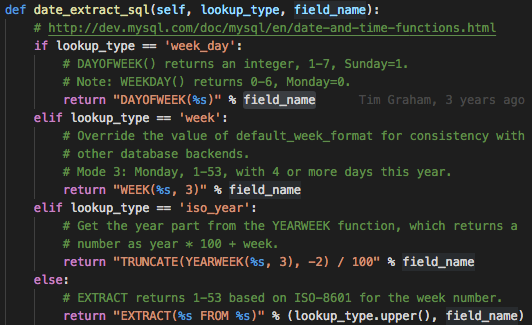
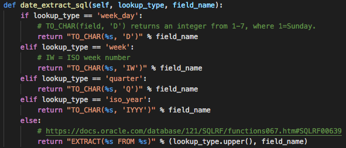
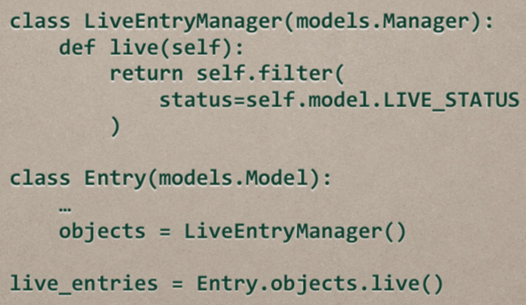

### ORM实现组成
- Model
- Manager
- QuerySet
- Query
- SQLCompiler
- Database backend

### DATABASE BACKENDS
1. 基类实现及支持的数据库的各自实现（django/db/models/backends）
2. 具体采用的是哪种实现依据数据库配置里面的ENGINE
3. ORM的底层行为的实现
4. 介于Django与DB driver模块之间

#### Databasewrapper
1. django.db.backends.base.BaseDatabasewrapper，其他数据库的实现继承自该类，代表一条数据库连接
2. 实现以下内容：
    - connection管理、cursor管理
    - 事务管理
    - 定义当前数据库类型下，Django field与column type的对应映射关系，Django operators与SQL之间的映射...

#### DatabaseOperations
1. django.db.backends.base.operations.BaseDatabaseOperations, 封装不同数据库的不同SQL表达
eg: 
mysql 
 
oracle 

2. sql to flushes / sequence resets

#### DatabaseFeatures
1. django.db.backends.base.features.BaseDatabaseFeatures 当前数据库支持的操作

#### DatabaseCreation
1. django.db.backends.creation.BaseDatabaseCreation  Encapsulate backend-specific differences pertaining to creation and destruction of the test database.

#### DatabaseIntrospection
- django.db.backends.introspection.BaseDatabaseIntrospection
- inspectdb命令的实现

#### DatabaseSchemaEditor
- django.db.backends.base.schema.BaseDatabaseSchemaEditor
- 用来做migrations

#### DatabaseClient
- django.db.backends.base.client.BaseDatabaseClient
- dbshell命令的实现

### SQLCompiler
- django.db.models.sql.compiler.SQLCompiler
- 将Django Query实例转化为SQL 
- SQLInsertCompiler/SQLDeleteCompliler/SQLUpdateCompiler/SQLAggregateCompiler
- Query.get_compiler() -> 调用DatabaseOperations.compiler() -> 通过DatabaseOperations.compiler_module找到SQLCompiler类 ==> 为该Query返回一个SQLCompiler实例

### Query
- django.db.models.sql.query
- 分为Query(普通ORM操作) / RawQuery(raw())
- 包含与query相关的属性
- 包含select/tables/where/group_by/order_by/aggregates等
- as_sql，生成SQL(self.get_compiler(connection=connection).as_sql())
- query是一个树桩的数据结构，将他转变为SQL的过程包括遍历他的子节点，调用他们的as_sql方法，生成最终SQL

### QuerySet
- django.db.models.query.QuerySet
- Query实例的高层封装，提供用户使用的API
- 同时相当于一个查询到的记录集合的容器

### Managers
- django.db.models.manager.Manager
- Model.objects.xxx
- get_queryset()为当前model返回一个QuerySet, Model.objects.xxx --> queryset.xxx
- do some custom...

### Models
- the actual representation of the data and associated logic
- 一个Model类对应数据库中的一张表，model的每个field对应数据表中的一列
- ModelBases: 所有model的元类

