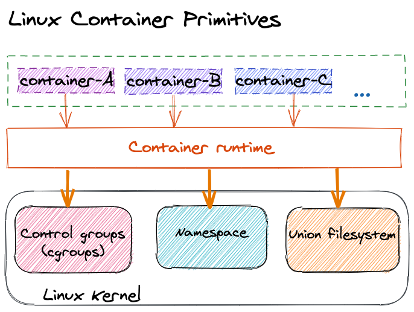
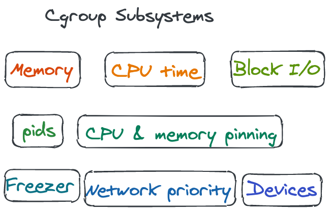
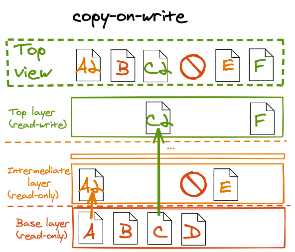
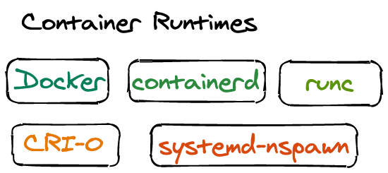

### 0. What is a container
容器（Containers）是基于几种 Linux 技术（如 Cgroups、Namespaces、Union filesystem）之上的抽象组合

### 1. Control groups
"limits how much you can use"
#### 1.1 cgroups 能力
- 组织系统中的所有进程
- 负责收集资源使用信息
- 对资源使用进行限制或者区分优先级

#### 1.2 Subsystems
Control group 是一个抽象框架，Subsystems 是具体实现     

subsystems 举例:

### 2. Namespaces
"limits what you can see"
#### 2.1 Namespaces 能力
- 资源隔离的机制
- 在 namespace 内对资源的修改对当前 namespace 之外不可见
- 资源映射

#### 2.2 可作 namespaces 的资源
- Network
- Filesystem (mounts)
- Processes (pid)
- Inter-process communication (ipc)
- Hostname and domain name (uts)
- User and groups IDs
- cgroup

<!-- Cgroups = limits how much you can use;          
namespaces = limits what you can see -->
unshare
### 3. Union Filesystem
#### 3.1 copy-on-write

待补充...

### Runtimes
用来管理配置 Linux 上述能力来在 host 上创建运行 containers 的软件工具     

### 参考
- https://youtu.be/sK5i-N34im8
- [Linux Container Primitives - cgroups, namespaces, and more!](https://youtu.be/x1npPrzyKfs)
- https://www.kernel.org/doc/Documentation/cgroup-v1/cgroups.txt
- https://tech.meituan.com/2015/03/31/cgroups.html
