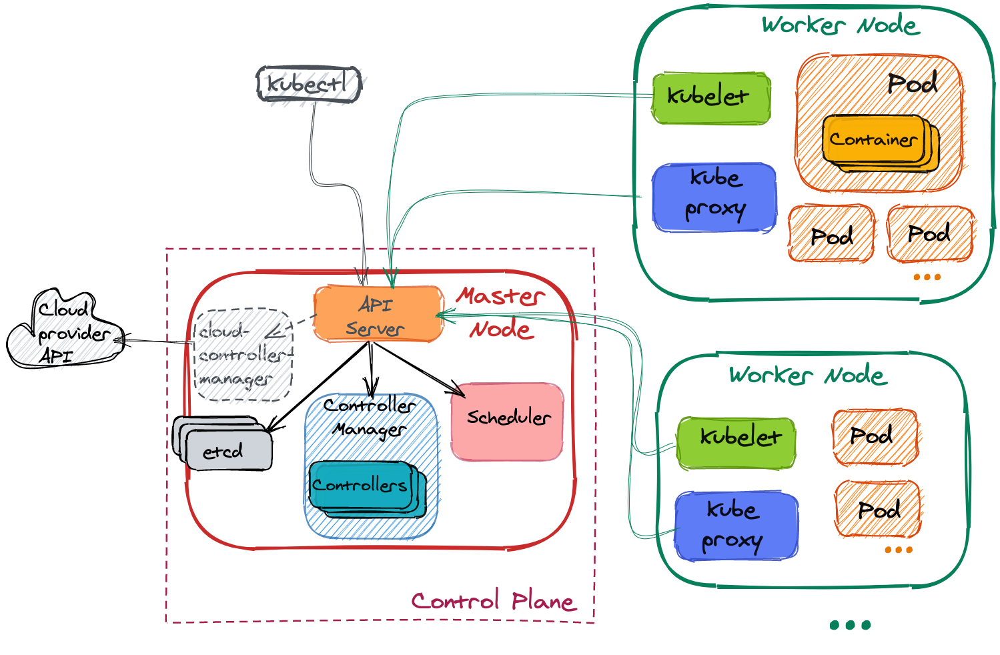

### 0. 架构图
Kubernetes 组件整体架构如下图

### 1. 控制面组件

#### 1.1 kube-apiserver
API server 是用于暴露 K8s API 的控制面组件，是控制面的前端端点     
主要实现是 [kube-apiserver](https://kubernetes.io/docs/reference/generated/kube-apiserver/)。kube-apiserver 可横向扩展

#### 1.2 etcd
一致性高可用 kv 存储，用作 K8s 集群数据的后备存储    
有关 etcd 的更多信息参阅[官网](https://etcd.io/docs/)

#### 1.3 kube-scheduler
用于给新创建的 Pods 分配 node 的控制面组件     
影响调度策略的因素包括：局部及整体的资源需求、硬件/软件/策略 限制、亲和性及反亲和性声明、数据位置、workload 间的干扰性及 deadlines

#### 1.4 kube-controller-manager
运行 controller 进程的控制面组件     
每个 controller 逻辑上是独立的，但为了降低复杂性，他们是被编译成一个二进制文件运行在同一个进程的     
这些 controller 包括：
- 节点控制器（Node controller）：负责在节点发生故障时的通知和响应
- 副本控制器（Replication controller）：为系统中所有副本控制器对象维持正确数量的 pods
- 端点控制器（Endpoints controller）：填充端点（Endpoints）对象（加入 Service 与 Pod）
- 服务账户和令牌控制器（Service Account & Token controllers）：为新的命名空间创建默认账户和 API 访问 token

#### 1.5 cloud-controller-manager(可选组件)
是接入特定云的控制逻辑的控制面组件       
如下列控制器包含对云平台驱动的依赖：
- 节点控制器（Node Controller）: 用于在节点终止响应后检查云提供商以确定节点是否已被删除
- 路由控制器（Route Controller）: 用于在底层云基础架构中设置路由
- 服务控制器（Service Controller）: 用于创建、更新和删除云提供商负载均衡器

### 2. Node 组件

#### 2.1 kubelet
运行在集群每个节点上的一个 agent，用于确保 containers 运行在 pod 中    
kubelet 根据提供的 PodSpecs 确保 containers 按期望的 PodSpecs 正常地运行。它不会管理不是通过 K8s 创建的容器

#### 2.2 kube-proxy
运行在集群每个节点上的网络代理，实现了 K8s Service 的部分概念     
kube-proxy 维护节点上的网络规则，这些规则允许从集群内部及外部与当前节点上的 Pod 的进行通信    
如果操作系统有网络包过滤层且可用的话，kube-proxy 会通过它来实现网络规则，否则 kube-proxy 自身会转发流量

#### 2.3 Container runtime
容器运行时（the container runtime）是一个负责运行 container 的软件     
K8s 支持多种容器运行时：Docker、containerd、CRI-O 及 任何 [Kubernetes CRI(Container Runtime Interface)](https://github.com/kubernetes/community/blob/master/contributors/devel/sig-node/container-runtime-interface.md)的实现

### 参考
- https://kubernetes.io/docs/concepts/overview/components/
- https://kubernetes.io/docs/concepts/architecture/control-plane-node-communication/
- https://draveness.me/understanding-kubernetes/
