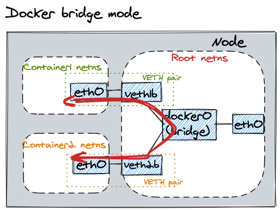
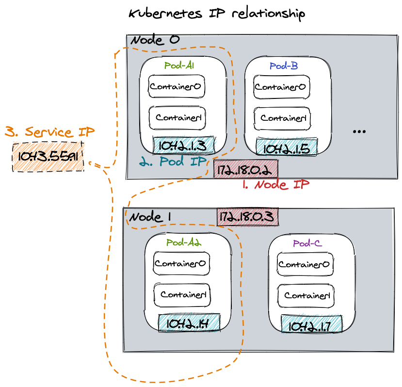

### Docker Networking
让我们先大致了解下 Docker Networking    
默认 bridge 模式    

通常 Docker 只负责当前同一 host/node 下的容器通信，不去暴露 container ip 给其他 host/node    
K8s 解决的问题之一就是不同 host/node 间的容器通信问题

### IP in Kubernetes
下面大概介绍下 K8s 中的三大类 IP
- **node IP**         
    - 节点 IP，每个 K8s 节点都需要有一个 IP 地址           
    - 其实不属于 K8s 管理的范畴，通过其他方式分配，如：DHCP、手动配置、云厂商分配等
- **pod IP**     
    - 一个 pod 里的多个 containers 共享同一个 network namespace     
    - 每个 pod 会被分配 IP 地址，通过你当前使用的 CNI(Container Network Interface) 插件的 IPAM 功能分配
        - 最基本的方式是通过给每个 node 分配一段 IP 地址段，node 再在这个地址段中分配 IP 给其上的 pod
        - 有些插件会动态分配 IP 段
    - kube-apiserver 通过启动参数 `--cluster-cidr=172.16.0.0.0/16` 来决定所有 pod 的 IP 地址段
- **service IP**
    - K8s service 是对一组 pod 的一个抽象
    - 所有 non-headless service 都有一个 ClusterIP
    - kube-apiserver 通过参数 `--service-cluster-ip-range=172.15.100.0/23` 来决定 ClusterIPs 的 IP 池
    - 通过 apiserver 组件管理分配，告诉 kubelet 进程 serives 与 IP 的映射关系，及 serivce 对应的 endpoints IP（如对应 pod 的 IP）

以上三者关系如图

### CNI

#### Flannel
Flannel 是早期的网络插件之一，适合小的 K8s 集群。运行在 OSI 网络模型的第二层数据链路层（Ethernet）       

**IPAM**    
Flannel 分配静态 IP 网段到 K8s Node，K8s Node 从分配到的网段再分配 IP 给 pod

**Encapsulation 封包**      
默认封包策略是 *VXLAN*（将 2 层以太网包封装到 UDP 包内）

#### Calico
Calico 运行在 OSI 网络模型的第三层网络层（IP），因此只有 IP 流量会被能被封装，and everything is routed

**IPAM**      
Calico 使用 K8s API server 或者自己的 etcd cluster 集群来实现了动态的网段划分

**Encapsulation 封包**
Calico 默认的封包策略是 “IP-in-IP”(将 3 层的 IP 包添加额外的 IP 头形成一个新的 IP 包)，开销很小，但只能封装 IP 包

### 参考
[Tutorial: Communication Is Key - Understanding Kubernetes Networking - Jeff Poole, Vivint Smart Home](https://youtu.be/InZVNuKY5GY)